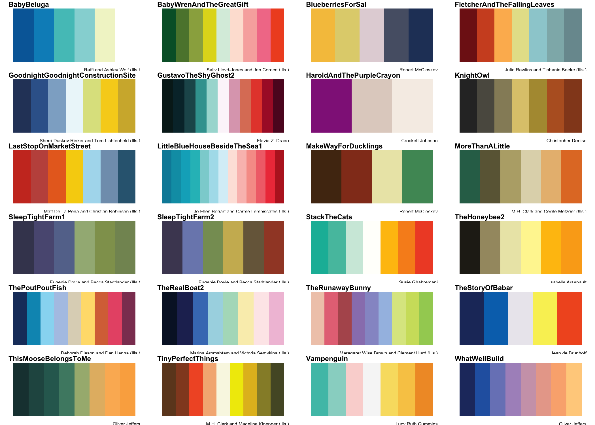
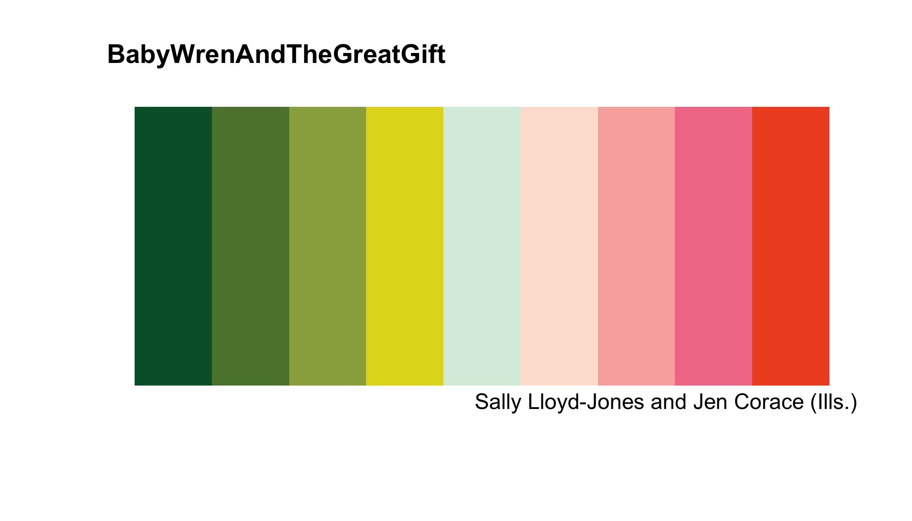
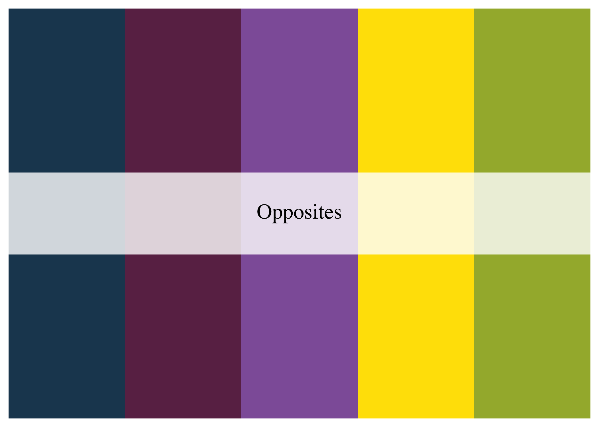
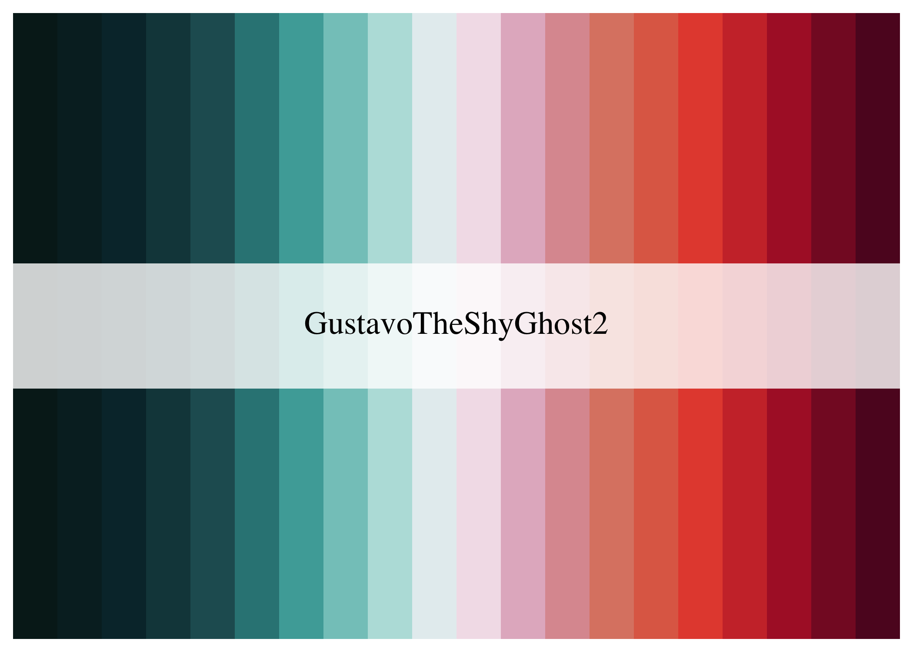
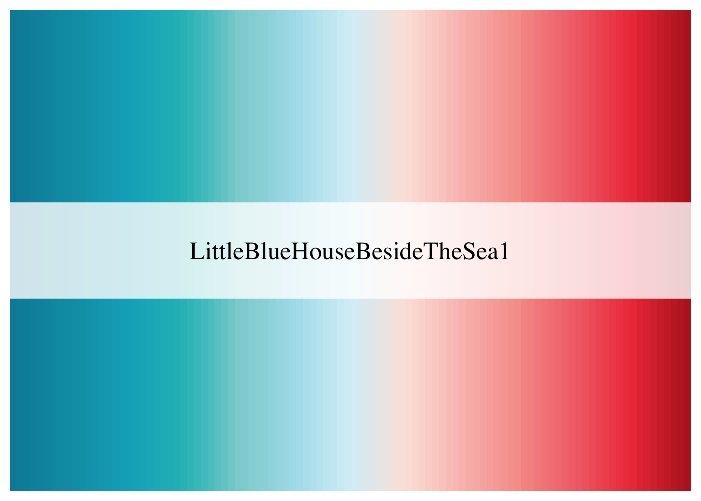
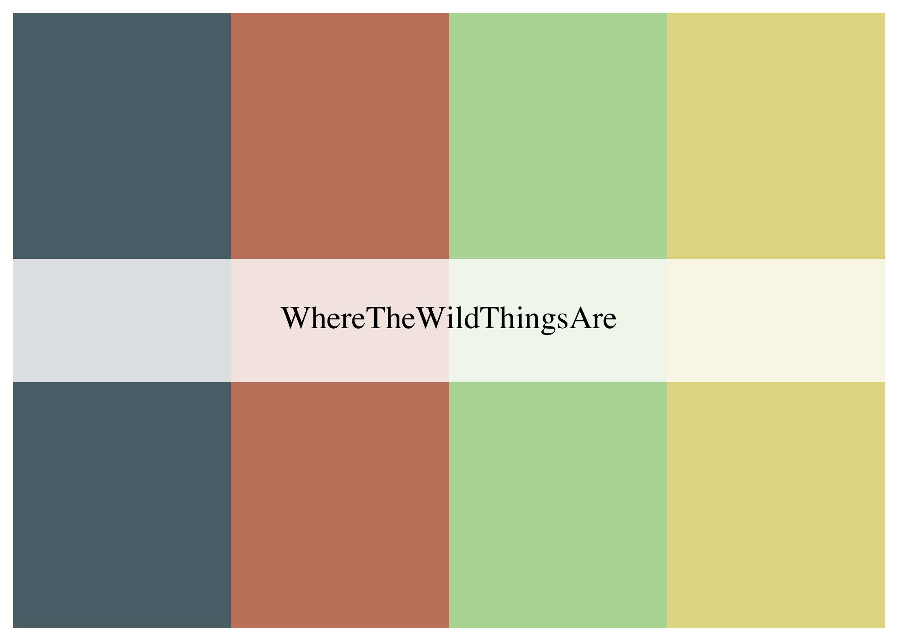
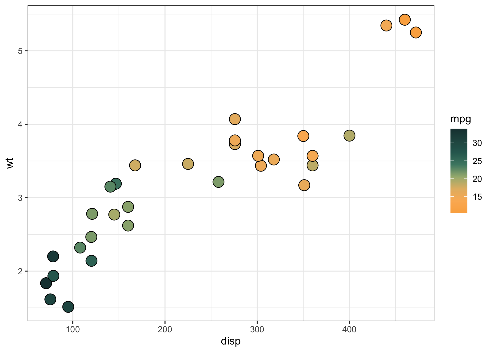
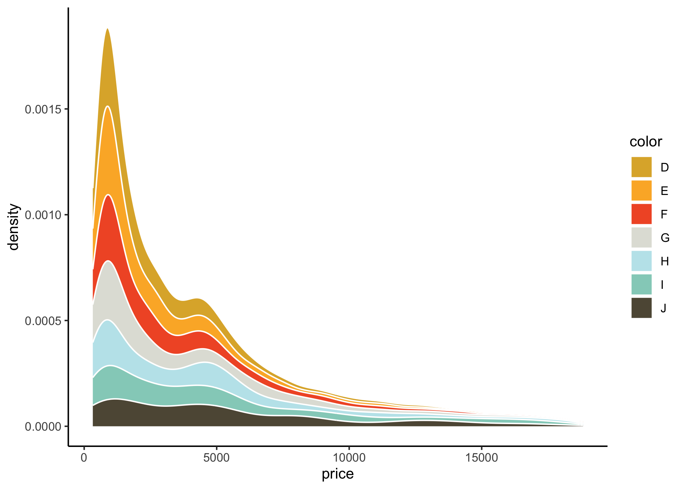
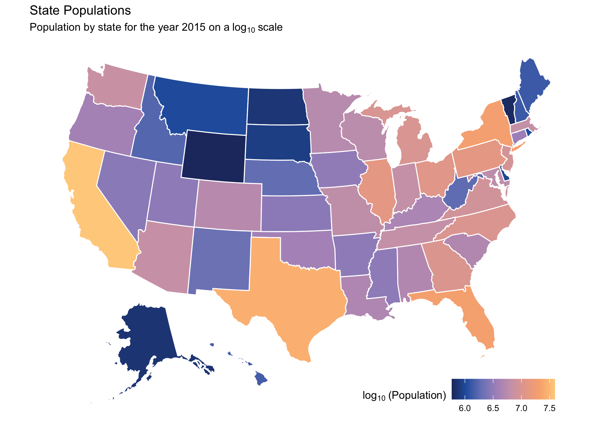

<!-- README.md is generated from README.Rmd. Please edit that file -->

# WrensBookshelf

<!-- badges: start -->

<div style="display: flex;">

<div>

This package is a collection of color pallettes that were extracted from
various books on my sons(Wren) bookshelf. Also included are a number of
functions and wrappers to utilize them in baseR and ggplot2 plotting
functions, as well as to subset the packages to desired number/specific
colors. It was heavily inspired by and modeled after the
[MetBrewer](https://github.com/BlakeRMills/MetBrewer) and
[wesanderson](https://github.com/karthik/wesanderson) packages, so if
you are here you should check them out too! Logo created using
[hexSticker](https://github.com/GuangchuangYu/hexSticker).

</div>

<div>


</div>

</div>

<!-- badges: end -->

## Installation

You can install the released version of WrensBookshelf from

``` r
devtools::install_github("buveges/WrensBookshelf")
```

## Palettes

### All palettes

Can view all palettes from Wren’s bookshelf using the `ShowBookshelf()`
function

``` r
library(WrensBookshelf)
ShowBookshelf()
```


``` r
names(WrensBookshelf)
#>  [1] "BabyBeluga"                      "BabyWrenAndTheGreatGift"        
#>  [3] "BlueberriesForSal"               "BoTheBrave"                     
#>  [5] "BoTheBraveCVDS"                  "BurtDow"                        
#>  [7] "BurtDowCVDS"                     "CapsForSale"                    
#>  [9] "GustavoTheShyGhostCover"         "GustavoTheShyGhostGraveyard"    
#> [11] "HaroldAndThePurpleCrayon"        "JeffGoesWild"                   
#> [13] "JulienIsAMermaid"                "LittleBlueHouseBesideTheSeaCont"
#> [15] "LittleBlueHouseBesideTheSeaDisc" "Madelline"                      
#> [17] "MakeWayForDucklings"             "MoreThanALittle"                
#> [19] "OhThePlacesYoullGo"              "Opposites"                      
#> [21] "StackTheCats"                    "TheDucklingGetsACookie"         
#> [23] "TheHoneybee"                     "TheHoneybeeDiverging"           
#> [25] "ThePoutPoutFish"                 "TheSnowyDay"                    
#> [27] "TheStoryOfBabar"                 "TheseWordsIShapedForYou"        
#> [29] "ThisMooseBelongsToMe"            "ThreeLittleVikings"             
#> [31] "TigerDays"                       "TinyPerfectThings"              
#> [33] "Vampenguin"                      "WhatWellBuild"                  
#> [35] "WhereTheWildThingsAre"           "YouMatter"
```

### Color Vision Deficiency (CVD) safe palettes

Can display only CVD safe palettes using `CVDsafe` option.

``` r
ShowBookshelf(CVDsafe = TRUE)
```


### Palettes for Discrete/Continuous data

All palettes can be used for either discrete or continuous data display,
however some apply themselves to one better than the other. Use the
`BestFor` option to view palettes that, in my own view, work best for
“discrete” or “continuous” variables. This can be combined/stacked with
the `CVDsafe` option as well

``` r
ShowBookshelf(BestFor = "continuous")
```



## Functions

### ShowBook()

Similar to `ShowBookshellf()` which shows all palettes with given
filters, but `ShowBook()` used to display a single book as a modified
plot object.

``` r
ShowBook(name ="BabyWrenAndTheGreatGift")
```



### WB_brewer()

Select/create palettes from Wren’s bookshelf.

``` r
WB_brewer("BurtDow")
```


``` r
WB_brewer("CapsForSale", n = 5, direction = 1, override.order = FALSE, type="discrete")
```



``` r
WB_brewer("GustavoTheShyGhostGraveyard", n = 20,type="continuous")
```



``` r
WB_brewer("LittleBlueHouseBesideTheSeaCont",100,type="continuous")
```

 ###
WB_subset_brewer()

This function is just another way of customizing palettes that I found
gives a little more intuitive control over the final product.

``` r
WB_subset_brewer(name = "WhereTheWildThingsAre", type = "discrete", LCR = c(1,4,5,6))
```



``` r
WB_subset_brewer(name = "JulienIsAMermaid", n = 5, LCR = "left", type = "continuous", n2 = 200)
```


### ggplot wrapper functions

Some convenience functions to make integration of palettes into ggplot2
easier.

``` r
library(ggplot2)

ggplot(mtcars, aes(x = disp, y = wt, color = factor(cyl)))+
  geom_point(size = 5)+
  scale_color_WB_d(name = "YouMatter")+
  theme_bw()
```


``` r
ggplot(mtcars, aes(x = disp,y = wt, fill= mpg))+
     geom_point(size=5, shape = 21)+
     scale_fill_WB_c(name = "BabyBeluga", direction = -1)+
     theme_bw()
```



``` r
df <- expand.grid(x = 1:25, y = 1:25)
vec <- c(seq(1:312), seq(313:1))
df <- cbind(df,vec)

ggplot(df, aes(x = x,y = y,fill = vec))+
  geom_tile()+
  scale_fill_WB_c("WhatWellBuild")+
  theme_void()
```



Can also simply utilize `WB_brewer()` within the normal ggplot2 scale
functions.

``` r
df <- expand.grid(x = 1:25, y = 1:25)
vec <- c(seq(1:312), seq(313:1))
df <- cbind(df,vec)

ggplot(df, aes(x = x,y = y,fill = vec))+
  geom_tile()+
  scale_fill_gradientn(colors = WB_brewer("Vampenguin"))+
  theme_void()
```


